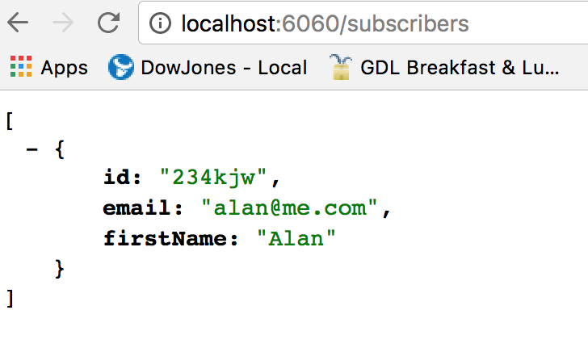

### Shop server
To install and run simply follow these steps:

1)  Clone this repo

2)  Open your terminal and run `node server.js`

3)  Your server is now available at `http://localhost:6060/`

4)  You can run a quick test by entering this in your browser: `http://localhost:6060/subscribers`

5)  Build your test data right in the server.js file. Create new endpoints as needed

